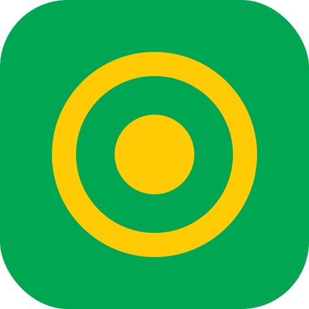

# OKR-system

Et komplet, kørende OKR-værktøj som webapp — bygget til at vise alignment på
tværs af niveauer, holde mål adskilt fra arbejde, og gøre det ugentlige
check-in-loop let. Fuldt client-side (ingen backend), forudfyldt med
realistisk dansk demo-data, så det er demobart i sekundet det åbner.



## Kom i gang

```bash
npm install
npm run dev      # starter på http://localhost:5173
```

Build til produktion:

```bash
npm run build    # tsc + vite build → dist/
npm run preview  # server den byggede app lokalt
```

Appen seeder sig selv i IndexedDB første gang den åbner. Vil du starte forfra,
brug **"Nulstil demo-data"** nederst i sidemenuen.

## Hvad kan det?

- **Alignment-træ** — hele hierarkiet fra virksomhedsmål ned til team-delmål i
  én foldbar trævisning, med fremdrifts-bjælker og farvet confidence.
- **30-sekunders check-in** — opdatér værdi + confidence (slider) + en kommentar
  i en mobilvenlig modal. Opdaterer KR'et og sparklines live overalt.
- **Auto-rollup** — parent-KR'er beregner deres fremdrift som et vægtet
  gennemsnit af bidragende child-KR'er. En ændring på team-niveau forplanter sig
  automatisk op til virksomhedsniveau.
- **Ledelses-dashboard** — rød/gul/grøn-sundhed på tværs af alle KR'er, mål i
  drift, manglende check-ins og committed/aspirational-opdeling. Filtrér på
  tribe/team og cyklus.
- **Fuld CRUD** — opret/redigér/slet objectives, key results og initiativer med
  bløde grænse-advarsler og en nudge mod udfaldsformulering på KR'er.
- **PWA** — manifest + service worker, så den kan installeres og virker offline.

## Domænemodel

Tre klart adskilte objekttyper håndhæves i både typer og UI:

| Type | Spørgsmål | Beskrivelse |
| --- | --- | --- |
| **Objective** | Hvor vil vi hen? | Kvalitativt, inspirerende, tidsbundet mål |
| **Key Result** | Hvordan ved vi det? | Målbart **udfald** — aldrig en opgave |
| **Initiativ** | Hvad gør vi? | Det konkrete arbejde der driver et KR |

Dertil: **Check-in** (ugentlig opdatering på et KR), **Alignment-kobling**
(mange-til-mange bidrag mellem KR'er) og **Cyklus** (kvartal).

### OKR best practice indbygget

- **Alignment, ikke cascade** — teams formulerer egne OKR'er der peger op mod
  parent-KR'er (både direkte og bidragende, mange-til-mange).
- **Confidence-scoring** med differentierede tærskler: aspirational måles mildere
  (0.7 = godt), committed strammere.
- **Bløde grænser** — advarer ved >5 objectives pr. niveau eller >4 KR pr.
  objective, men blokerer aldrig.
- **Ingen lønkobling** — systemet antyder aldrig performance/bonus.

## Teknologi

Vite · React 18 · TypeScript · Tailwind CSS · Zustand · Dexie (IndexedDB) ·
React Router · Recharts · lucide-react · date-fns.

## Projektstruktur

```
src/
  types/domain.ts        Domænetyper
  lib/okr.ts             Beregninger: fremdrift, confidence-sundhed, auto-rollup
  lib/selectors.ts       Afledte selektorer (objective-summary m.m.)
  db/database.ts         Dexie-schema
  db/seed.ts             Realistisk dansk demo-data (Nordlys Games)
  db/repository.ts       Data-adgang + seeding
  store/useStore.ts      Zustand: data + afledte maps + mutationer
  store/useUi.ts         Zustand: modal-/editor-state
  components/            Genbrugskomponenter + modaler
  pages/                 Trævisning, detaljer, dashboard
```

Se [`DECISIONS.md`](DECISIONS.md) for designvalg og [`PROGRESS.md`](PROGRESS.md)
for byggeforløbet.
